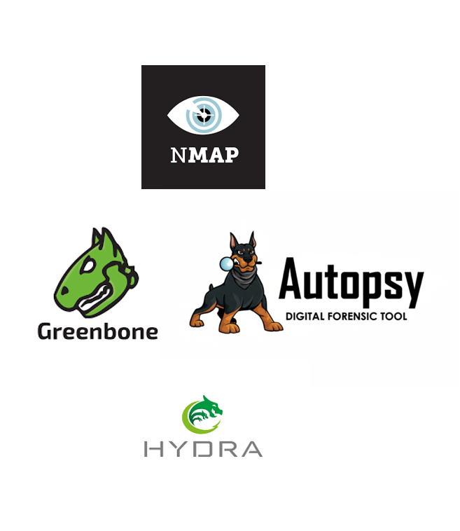
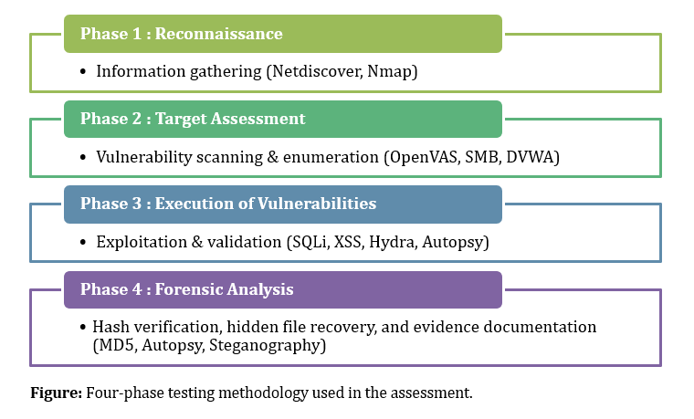

# Capstone Project – VAPT & Forensic Analysis

## Project Overview  
This capstone project demonstrates a full cybersecurity assessment combining **Vulnerability Assessment & Penetration Testing (VAPT)** with **Digital Forensic Evidence Collection & Analysis** in a simulated corporate lab network of TechShield.

The objective was to emulate realistic cyber-attacks, ethically exploit system and web vulnerabilities, and then perform forensic validation to ensure evidence integrity and traceability.

**Core Focus Areas**
- Network & web application security testing  
- Ethical exploitation to validate vulnerabilities  
- Password security testing  
- Forensic image verification & hidden evidence recovery  

---

## Problem Statement  
TechShield observed repeated test-environment security incidents due to:

- Weak system and application configurations  
- Outdated operating systems & unpatched services  
- Weak password practices  
- Limited forensic readiness for incident investigation  

**Goal:** Conduct a structured VAPT engagement integrated with forensic procedures to strengthen security posture and improve incident response capability.

---

## Tools & Platforms Used  
| Category | Tools |
|---|---|
| Recon & Scanning | Netdiscover, Nmap, Greenbone/OpenVAS |
| Web Exploitation | DVWA (SQLi, XSS, File Upload, Reverse Shell) |
| Password Attacks | Hydra |
| System Exploitation | Metasploit (MS17-010 / EternalBlue) |
| Digital Forensics | Autopsy, md5sum |

  
*Tools and platforms used*

---

## Approach (Phased Testing)
1. **Reconnaissance** — Host discovery, port scanning, service enumeration  
2. **Target Assessment** — Vulnerability scanning & password checks  
3. **Exploitation & Validation** — Ethical exploitation to confirm risks  
4. **Forensic Analysis** — Evidence integrity validation & recovery of hidden files  

  
*Four-phase testing methodology*

---

## Project Outcomes  
**58 security vulnerabilities identified**  
- 16 High  
- 38 Medium  
- 4 Low  

Successfully exploited outdated Windows machine (MS17-010 / EternalBlue)  
Cracked weak passwords using Hydra  
> `Administrator: P@ssw0rd`  
> `student: P@ssw0rd`

Exploited DVWA vulnerabilities  
- SQL Injection  
- Stored XSS  
- File upload to remote command execution  
- Reverse shell access  

Digital Forensics Success  
- Verified forensic image integrity with MD5 hashes  
- Recovered **5 hidden evidence files**  
- Detected disguised image files & potential obfuscation  
- Maintained proper chain of custody  

---

## Recommendations  
| Area | Recommendation |
|---|---|
Patch Management | Upgrade unsupported OS & apply critical patches  
Authentication | Strong password policy, MFA, lockout policy  
Network Security | Disable SMBv1, restrict SMB/RDP access  
Web Security | Input validation, secure file upload controls, WAF  
Forensic Readiness | Standardize forensic processes, SIEM logging & alerting  

---

## Key Skills Demonstrated  
- Vulnerability Assessment & Reporting  
- Penetration Testing & Exploitation  
- Web Application Security Testing  
- OS & Network Security Analysis  
- Password Security & Brute-force Attacks  
- Digital Forensics & Evidence Handling  
- Documentation & Chain-of-Custody Procedures  

---

## Screenshots & Evidence (Add in Repo)
> Nmap results  
> OpenVAS scan findings  
> SQLi & XSS exploits  
> Reverse shell terminal evidence  
> Hash verification screenshots  
> Recovered forensic images

---

## Conclusion  
This project demonstrates hands-on ability to:

- Identify and exploit real-world security weaknesses  
- Analyze and secure networks and web applications  
- Perform forensic integrity checks and evidence recovery  
- Produce structured, professional reporting and recommendations  

It reflects a comprehensive understanding of both **offensive security** and **digital forensic practices**, essential for modern cybersecurity roles.

